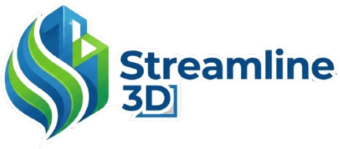

# 🧊 Streamline 3D — Gerenciador Inteligente de Assets

<p align="center">
  
</p>

<p align="center">
  
  
  
  
  
</p>

---

O **Streamline 3D** é um ecossistema moderno voltado para a centralização, organização e visualização fluida de assets tridimensionais (como modelos, texturas, HDRIs e materiais). O projeto unifica uma interface web baseada em **Three.js**, persistência na nuvem com **Supabase**, sincronização via **Rclone** e um microsserviço automatizado que traduz arquivos nativos do Blender (`.blend`) em formatos interativos prontos para a web (`.glb`).

---

## 🚀 Funcionalidades Principais

* **🎛️ Visualização 3D Nativa:** Renderização instantânea de arquivos `.glb` direto no browser com iluminação dinâmica, órbita suave via `OrbitControls` e enquadramento inteligente por Bounding Box.
* **📦 Pipeline de Conversão Inteligente (`.blend` ➡️ `.glb`):** Backend Node.js conectado à API Python do Blender (`bpy`) que limpa, otimiza e exporta dados geométricos em tempo de execução.
* **🏷️ Organização Avançada:** Categorização automática em categorias fundamentais: **Models**, **Textures**, **HDRIs**, **Materials**, **Brushes** e **Plugins** com suporte a coleções sob demanda.
* **🔐 Ecossistema Seguro:** Fluxo completo de autenticação corporativa (Registro, Login, Recuperação de senha) gerenciado via **Supabase Auth**.
* **☁️ Cloud Sync Integrado:** Ponte otimizada com o executável **Rclone** para espelhamento e descarregamento de assets pesados para storages remotos (como Google Drive).

---

## 📂 Arquitetura do Sistema

A árvore do projeto separa rigidamente a camada visual gerenciada pelo bundler **Vite** da lógica nativa de processamento local:

```text
Streamline3D/
├── css/
│   └── style.css              # Grid responsivo e design focado em Dark Mode
├── img/                       # Identidade visual e logos da aplicação
├── js/
│   ├── model.js               # Camada de Dados & Integração direta Supabase
│   ├── view.js                # Manipulação do DOM & Engine Gráfica Three.js
│   └── controller.js          # Orquestrador de eventos de Interface / Negócio
├── backend/
│   ├── server.js              # Servidor Express (API de uploads e subprocessos)
│   └── conversor.py           # Script autônomo Python (Blender bpy API)
├── rclone-v1.74.3/            # Binário portátil do Rclone para controle cloud
├── index.html                 # Ponto de entrada do app (HTML5 estrutural)
├── .env                       # Variáveis de ambiente privativas
└── package.json               # Gerenciador de scripts e dependências da stack
```
---

## 🛠️ Pré-requisitos

Antes de iniciar, certifique-se de possuir em seu ambiente local:

* **Node.js** (v18.0.0 ou superior)
* **Blender LTS** devidamente adicionado ao seu `PATH` global (para ativação via CLI)
* Uma instância configurada no **Supabase**

---

## 🔧 Configuração e Inicialização

### 1. Clonagem e Dependências

Obtenha o repositório e instale os pacotes de ambos os escopos (Client e Server):

```bash
# Dependências do Frontend (Vite)
npm install

# Dependências do Pipeline de Conversão (Backend)
cd backend
npm install express multer cors
cd ..

```

### 2. Rodando o Ambiente

Inicie os servidores em instâncias separadas do seu terminal para monitorar os logs:

**Painel Web (Frontend):**

```bash
npm run dev

```

🌐 *Disponível em `http://localhost:5173*`

**Microsserviço Core (Backend):**

```bash
node backend/server.js

```

⚙️ *Ouvindo requisições de conversão e pontes de dados na porta `3000*`

---

## 💻 Pipeline Técnico: Conversão Headless

O motor de conversão opera de forma assíncrona para não travar a UI do usuário:

```
[Upload .blend] ➡️ [Server Express] ➡️ [Blender Headless via CLI] ➡️ [conversor.py (bpy)] ➡️ [Output .glb] ➡️ [Three.js Client Render]

```

1. O cliente despacha o arquivo `.blend` para o endpoint `/api/convert`.
2. O Node.js escreve o buffer em cache temporário e invoca um processo isolado em plano de fundo:
```bash
blender -b -P backend/conversor.py -- <input.blend> <output.glb>

```


3. O script `conversor.py` força um reset de fábrica vazio via `bpy.ops.wm.read_factory_settings()`, injeta a cena do usuário, remapeia as texturas e executa a compilação binária do formato glTF.
4. O binário resultante é retornado via stream HTTP diretamente para a View do app.

---

## 🛠️ Comandos Disponíveis

| Comando | Operação |
| --- | --- |
| `npm run dev` | Inicia o compilador em tempo real do Vite. |
| `npm run build` | Consolida e minimiza a aplicação para deploy em `/dist`. |
| `npm run preview` | Testa o build estático de produção localmente. |

---

## ⚡ Tecnologias Utilizadas

O **Streamline 3D** foi construído utilizando uma stack moderna e modular, dividida entre uma interface de alta performance voltada para a web e um microsserviço otimizado para tarefas de automação tridimensional e sincronização.

### 🎨 Frontend (Client-Side)
* **[Three.js](https://threejs.org/) & Addons:** Engine gráfica utilizada para criar a cena 3D nativa no navegador, utilizando o `GLTFLoader` para renderização de malhas complexas, `OrbitControls` para navegação imersiva e `RoundedBoxGeometry` para componentes procedurais.
* **Vanilla JavaScript (ES6+):** Arquitetura purista baseada em módulos nativos (`import`/`export`) estruturada estritamente sob o padrão **MVC (Model-View-Controller)** para separar o ciclo de vida dos dados da renderização da interface.
* **CSS3 Avançado:** Interface responsiva construída do zero utilizando *CSS Grid* e *Flexbox*, contando com variáveis globais (*Custom Properties*) para gerenciamento dinâmico do tema Dark Mode.
* **[Vite](https://vitejs.dev/):** Ferramenta de build ultra-rápida utilizada como bundler de desenvolvimento e responsável por otimizar e compilar os assets estáticos para produção.

### ⚙️ Backend (Server-Side) & Microservices
* **[Node.js](https://nodejs.org/) & Express:** Servidor HTTP escalável responsável por gerenciar os endpoints da API, fluxo de upload de arquivos pesados e chamadas assíncronas do sistema.
* **Multer:** Middleware de manipulação que gerencia o recebimento de arquivos em tempo de execução (`multipart/form-data`) diretamente na memória ou em diretórios temporários.
* **[Blender Python API (bpy)](https://docs.blender.org/api/current/index.html):** Módulo interno do Blender utilizado via terminal (*headless mode*) pelo script `conversor.py` para carregar dados nativos e gerar arquivos `.glb` otimizados de forma 100% autônoma.

### ☁️ Infraestrutura & Persistência
* **[Supabase](https://supabase.com/):** Plataforma de infraestrutura *Backend-as-a-Service* (BaaS). Atua diretamente em duas frentes cruciais:
    * **Supabase Database (PostgreSQL):** Gerenciamento e relacionamento de metadados dos assets, categorias e coleções.
    * **Supabase Auth:** Controle de sessão criptografado, lidando com registro, login e redefinição de senhas com tokens JWT.
* **[Rclone](https://rclone.org/):** Utilitário de linha de comando integrado diretamente ao backend do app para realizar conexões seguras e sincronizar grandes volumes de arquivos diretamente para storages em nuvem (como Google Drive, AWS S3 ou OneDrive).

---

## 📄 Licença

Este ecossistema está protegido sob as diretrizes das licenças **MIT**.